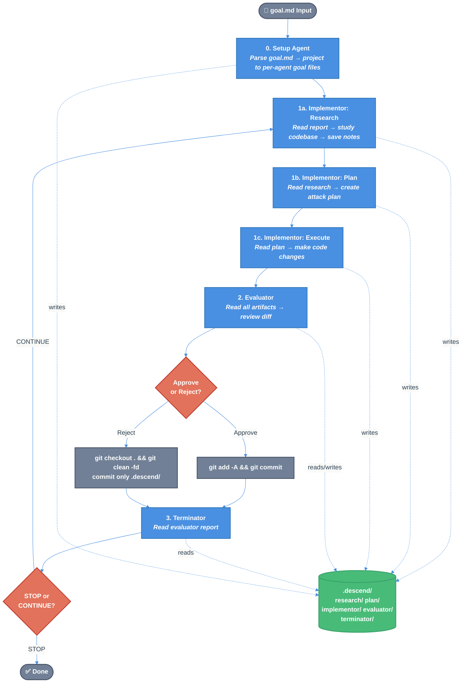

# Agent-Descent Technical Design Document

| Document Metadata      | Details                                              |
| ---------------------- | ---------------------------------------------------- |
| Author(s)              | Lef Ioannidis                                        |
| Status                 | Approved                                             |
| Team / Owner           | Lef Ioannidis                                        |
| Created / Last Updated | 2026-04-07 / 2026-04-08                             |

## 1. Executive Summary

Agent-descent is a multi-agent loop system built on the `@github/copilot-sdk` for Node.js that simulates gradient descent using three independent agents. The user provides a single `goal.md` file containing three sections — **Goal to implement**, **Progress metric**, and **Termination condition** — which a one-time **Setup** agent projects into agent-specific goal files (`.descend/implementor/goal.md`, `.descend/evaluator/goal.md`, `.descend/terminator/goal.md`). An **Implementor** agent (research → plan → execute) works toward the goal. An **Evaluator** agent reviews the work, approving changes (git commit) or rejecting them (git revert + explanation). A **Terminator** agent decides when the evaluator's report is trivial enough to stop the loop. Each iteration all agents start fresh — state flows exclusively through files in the `.descend/` directory and git history. All agent output is printed to the terminal with color-coded prefixes.

**Research references:**
- [Copilot SDK API Reference](../research/docs/2026-04-07-copilot-sdk-nodejs-api.md)
- [Architecture Design](../research/docs/2026-04-07-agent-descent-architecture.md)

---

## 2. Context and Motivation

### 2.1 Current State

There is no existing implementation. The repository contains only a README placeholder and research documents produced during the design phase.

### 2.2 The Problem

Building reliable agentic systems is hard because single-shot agents lack the feedback mechanisms that enable iterative improvement. This project explores a **closed-loop multi-agent pattern** inspired by gradient descent:
- An implementor takes a step toward the goal
- An evaluator computes the "loss" (quality assessment)
- A terminator checks for convergence (is the goal achieved?)
- The loop repeats until convergence or a safety cap

This is both a useful tool (autonomous goal-driven coding) and an architectural experiment (can structured agent feedback loops converge reliably?).

---

## 3. Goals and Non-Goals

### 3.1 Functional Goals

- [ ] Single `goal.md` input file with three sections: Goal to implement, Progress metric, Termination condition
- [ ] One-time Setup agent that projects `goal.md` sections into per-agent goal files in `.descend/`
- [ ] Three independent agents (implementor, evaluator, terminator) running in a sequential loop
- [ ] Implementor runs in three phases: research → plan → execute
- [ ] Evaluator reads all `.descend/` artifacts + git diff, approves or rejects with explanation
- [ ] Terminator reads evaluator report, decides CONTINUE or STOP
- [ ] All agent artifacts stored in `.descend/` directory (committed to git)
- [ ] Color-coded terminal output with agent prefixes for all agent activity
- [ ] Git workflow: approve → commit all; reject → revert code, commit only `.descend/`
- [ ] Fresh Copilot SDK sessions each iteration (no context bleed)
- [ ] Structured decision tools (not NL parsing) for evaluator and terminator

### 3.2 Non-Goals (Out of Scope)

- [ ] Parallel agent execution (sequential only for v1)
- [ ] Web UI or dashboard
- [ ] Persistent memory across runs (each invocation starts fresh)
- [ ] Multi-model orchestration (single model config per agent)
- [ ] Fleet API usage (experimental/undocumented)
- [ ] Custom MCP servers

---

## 4. Proposed Solution (High-Level Design)

### 4.1 System Architecture Diagram



### 4.2 Architectural Pattern

**Iterative Agent Loop with File-Based State Transfer.** Each agent is a stateless session that communicates via the filesystem (`.descend/` folder + git). The loop orchestrator (`src/index.ts`) drives the sequence, reading decision tool outputs to control flow.

This is analogous to a **pipeline with feedback**: Implementor → Evaluator → Terminator → (loop or exit). The evaluator's reject path feeds back improved guidance for the next iteration.

### 4.3 Key Components

| Component | Responsibility | Technology | Justification |
|-----------|---------------|------------|---------------|
| Loop Orchestrator | Drives iteration sequence, manages sessions | TypeScript, `@github/copilot-sdk` | SDK provides `sendAndWait()` for synchronous flow |
| Setup Agent | One-time projection of `goal.md` into per-agent goal files | 1 SDK session + `projectGoal` function | Translates user intent into agent-specific instructions once |
| Implementor Agent | Three-phase goal pursuit (research/plan/execute) | 3 SDK sessions per iteration | Phase isolation prevents plan/execute confusion |
| Evaluator Agent | Code review + approve/reject decision | 1 SDK session + `submit_decision` tool | Structured tool output avoids NL parsing |
| Terminator Agent | Convergence detection | 1 SDK session + `make_decision` tool | Stateless = simple, cheap model viable |
| Goal Projector | Parses `goal.md` sections and writes per-agent goal files | Pure function, no SDK | Deterministic projection, testable in isolation |
| Decision Tools | Structured agent output capture | `defineTool` + Zod schemas | Programmatic decision capture |
| Logger | Color-coded terminal output | Node.js `process.stdout` + ANSI codes | Real-time visibility into agent behavior |
| Git Manager | Commit/revert/diff operations | `child_process.execSync` | Simple, synchronous git ops |

---

## 5. Detailed Design

### 5.1 Project Structure

```
agent-descent/
├── package.json
├── tsconfig.json
├── goal.md                                  # User-provided goal (the only argument)
├── src/
│   ├── index.ts                          # Main entry — setup + loop orchestrator
│   ├── agents/
│   │   ├── setup.ts                      # One-time setup agent (goal projection)
│   │   ├── implementor.ts                # 3-phase implementor (research/plan/exec)
│   │   ├── evaluator.ts                  # Evaluator agent runner
│   │   └── terminator.ts                 # Terminator agent runner
│   ├── prompts/
│   │   ├── implementor-research.ts       # Research phase system prompt
│   │   ├── implementor-plan.ts           # Plan phase system prompt
│   │   ├── implementor-exec.ts           # Execute phase system prompt
│   │   ├── evaluator.ts                  # Evaluator system prompt
│   │   └── terminator.ts                # Terminator system prompt
│   ├── tools/
│   │   └── decisions.ts                  # defineTool: submit_decision, make_decision
│   └── utils/
│       ├── logger.ts                     # Colored agent-prefixed console output
│       ├── git.ts                        # Git diff, commit, revert, clean
│       └── goal.ts                       # goal.md parser + projection function
├── .descend/                             # Agent artifacts (gittracked)
│   ├── research/                         # Implementor research notes
│   ├── plan/                             # Implementor attack plans
│   ├── implementor/
│   │   ├── goal.md                       # Projected goal for implementor (from setup)
│   │   └── report.md                     # Execution log
│   ├── evaluator/
│   │   ├── goal.md                       # Projected goal for evaluator (from setup)
│   │   └── report.md                     # Evaluator verdict + report
│   └── terminator/
│       └── goal.md                       # Projected goal for terminator (from setup)
└── research/                             # Project research (not agent-managed)
    └── docs/
```

### 5.2 Module Design

#### 5.2.1 `src/index.ts` — Loop Orchestrator

The main entry point. Responsibilities:
1. Parse CLI arguments (`goal.md` file path — the only argument)
2. Initialize `CopilotClient` and start the CLI server
3. Run the one-time Setup agent to project `goal.md` into per-agent goal files
4. Run the iteration loop:
   - Call `runImplementorResearch(client, context)`
   - Call `runImplementorPlan(client, context)`
   - Call `runImplementorExec(client, context)`
   - Call `runEvaluator(client, context)` → returns `{decision, summary}`
   - If approved: `gitCommit(iteration, summary)`
   - If rejected: `gitRevert()` then `gitCommitDescendOnly(iteration, reason)`
   - Call `runTerminator(client, context)` → returns `{decision, reason}`
   - If "stop": break
5. Final summary and exit

```typescript
// Pseudocode — src/index.ts
interface LoopContext {
    goalPath: string;          // path to original goal.md
    iteration: number;
    maxIterations: number;
    workingDir: string;
    models: {
        implementor: string;   // default: "claude-sonnet-4.5"
        evaluator: string;     // default: "claude-sonnet-4.5"
        terminator: string;    // default: "gpt-4.1"
    };
}

const MAX_RETRIES = 2;

async function main() {
    const args = parseArgs();  // goal.md path + optional flags
    if (!args.goalPath) throw new Error("Usage: agent-descent <goal.md> [--max-iterations N] [--implementor-model M] [--evaluator-model M] [--terminator-model M]");

    const client = new CopilotClient({ logLevel: "none" });
    await client.start();

    const ctx: LoopContext = {
        goalPath: args.goalPath,
        iteration: 0,
        maxIterations: args.maxIterations ?? 10,
        workingDir: process.cwd(),
        models: {
            implementor: args.implementorModel ?? "claude-sonnet-4.5",
            evaluator: args.evaluatorModel ?? "claude-sonnet-4.5",
            terminator: args.terminatorModel ?? "gpt-4.1",
        },
    };

    // One-time setup: project goal.md into per-agent goal files
    await runSetup(client, ctx);

    for (ctx.iteration = 1; ctx.iteration <= ctx.maxIterations; ctx.iteration++) {
        log.system(`--- Iteration ${ctx.iteration} ---`);
        
        try {
            await withRetry(() => runImplementorResearch(client, ctx), MAX_RETRIES);
            await withRetry(() => runImplementorPlan(client, ctx), MAX_RETRIES);
            await withRetry(() => runImplementorExec(client, ctx), MAX_RETRIES);
            
            const evalResult = await withRetry(() => runEvaluator(client, ctx), MAX_RETRIES);
            if (evalResult.decision === "approve") {
                gitCommit(ctx.iteration, evalResult.summary);
            } else {
                gitRevert();
                gitCommitDescendOnly(ctx.iteration, evalResult.summary);
            }
            
            const termResult = await withRetry(() => runTerminator(client, ctx), MAX_RETRIES);
            if (termResult.decision === "stop") {
                log.system(`🏁 Converged after ${ctx.iteration} iterations: ${termResult.reason}`);
                break;
            }
        } catch (err) {
            // All retries exhausted — treat as rejection and continue
            log.system(`⚠️ Iteration ${ctx.iteration} failed after retries: ${err.message}`);
            gitRevert();
            writeFile(".descend/evaluator/report.md", `# Error Report\n\nIteration ${ctx.iteration} failed: ${err.message}\n\nThe implementor should retry the previous approach or try a different strategy.`);
            gitCommitDescendOnly(ctx.iteration, `error: ${err.message}`);
        }
    }

    await client.stop();
}
```

#### 5.2.2 `src/utils/goal.ts` — Goal Parser & Projection

Parses the user's `goal.md` file and projects its three sections into per-agent goal files. This is a **pure function** — no SDK dependency, testable in isolation.

**Input format** (`goal.md`):

```markdown
## Goal to implement
<what the user wants built — free-form description>

## Progress metric
<how to measure progress — what the evaluator should judge against>

## Termination condition
<when to stop — what "done" looks like for the terminator>
```

**Projection function:**

```typescript
// src/utils/goal.ts
import { readFileSync, writeFileSync, mkdirSync } from "fs";

interface ParsedGoal {
    goalToImplement: string;
    progressMetric: string;
    terminationCondition: string;
}

export function parseGoalFile(goalPath: string): ParsedGoal {
    const content = readFileSync(goalPath, "utf-8");
    const sections = extractSections(content, [
        "Goal to implement",
        "Progress metric",
        "Termination condition",
    ]);
    return {
        goalToImplement: sections["Goal to implement"],
        progressMetric: sections["Progress metric"],
        terminationCondition: sections["Termination condition"],
    };
}

function extractSections(content: string, headings: string[]): Record<string, string> {
    const result: Record<string, string> = {};
    for (const heading of headings) {
        const regex = new RegExp(`## ${heading}\\s*\\n([\\s\\S]*?)(?=\\n## |$)`, "i");
        const match = content.match(regex);
        if (!match) throw new Error(`goal.md missing required section: "## ${heading}"`);
        result[heading] = match[1].trim();
    }
    return result;
}

export function projectGoalFiles(parsed: ParsedGoal): void {
    mkdirSync(".descend/implementor", { recursive: true });
    mkdirSync(".descend/evaluator", { recursive: true });
    mkdirSync(".descend/terminator", { recursive: true });

    writeFileSync(".descend/implementor/goal.md", [
        "# Implementor Goal",
        "",
        "## What to build",
        parsed.goalToImplement,
    ].join("\n"));

    writeFileSync(".descend/evaluator/goal.md", [
        "# Evaluator Goal",
        "",
        "## What to evaluate against",
        parsed.goalToImplement,
        "",
        "## Progress metric",
        parsed.progressMetric,
    ].join("\n"));

    writeFileSync(".descend/terminator/goal.md", [
        "# Terminator Goal",
        "",
        "## Termination condition",
        parsed.terminationCondition,
        "",
        "## Progress metric",
        parsed.progressMetric,
    ].join("\n"));
}
```

**Design rationale:** The projection is deterministic and runs once. The implementor gets only the goal (what to build). The evaluator gets the goal plus the progress metric (how to judge). The terminator gets the termination condition plus the progress metric (when to stop). Each agent sees only the information relevant to its role.

#### 5.2.3 `src/agents/setup.ts` — Setup Agent (One-Time)

Runs once before the loop begins. Parses `goal.md`, writes the projected goal files, and commits them to `.descend/`.

```typescript
// Pseudocode — src/agents/setup.ts
import { parseGoalFile, projectGoalFiles } from "../utils/goal.js";

export async function runSetup(client: CopilotClient, ctx: LoopContext): Promise<void> {
    log.system("🎯 Setup: parsing goal.md and projecting per-agent goals...");

    const parsed = parseGoalFile(ctx.goalPath);
    projectGoalFiles(parsed);

    log.system("✅ Goal files projected:");
    log.system("   .descend/implementor/goal.md");
    log.system("   .descend/evaluator/goal.md");
    log.system("   .descend/terminator/goal.md");

    // Commit the initial goal projection
    gitCommitDescendOnly(0, "setup: projected goal.md into per-agent goal files");
}
```

**Ref:** [Architecture §2.1](../research/docs/2026-04-07-agent-descent-architecture.md) — the setup phase runs before the loop begins.

#### 5.2.4 `src/agents/implementor.ts` — Three-Phase Implementor

Exports three functions, one per phase. Each creates a fresh SDK session, sends a prompt with context, waits for completion, then cleans up.

```typescript
// Pseudocode — src/agents/implementor.ts

export async function runImplementorResearch(client: CopilotClient, ctx: LoopContext): Promise<void> {
    const goalFile = readFile(".descend/implementor/goal.md");
    const evaluatorReport = readFileOrDefault(".descend/evaluator/report.md", "No previous report.");
    const session = await client.createSession({
        model: ctx.model ?? "claude-sonnet-4.5",
        systemMessage: { mode: "replace", content: IMPLEMENTOR_RESEARCH_PROMPT },
        onPermissionRequest: approveAll,
        infiniteSessions: { enabled: false },
        streaming: true,
    });
    attachLogger(session, "implementor:research");
    await session.sendAndWait({
        prompt: `## Goal\n${goalFile}\n\n## Previous Evaluator Report\n${evaluatorReport}\n\nResearch what is needed. Save notes to .descend/research/.`,
    });
    await session.disconnect();
    await client.deleteSession(session.sessionId);
}

export async function runImplementorPlan(client: CopilotClient, ctx: LoopContext): Promise<void> {
    // Similar pattern — reads .descend/research/, writes to .descend/plan/
}

export async function runImplementorExec(client: CopilotClient, ctx: LoopContext): Promise<void> {
    // Similar pattern — reads .descend/plan/, makes code changes, writes .descend/implementor/report.md
}
```

**Ref:** [Architecture §2.1 — Implementor Agent](../research/docs/2026-04-07-agent-descent-architecture.md) for full phase specifications.

#### 5.2.5 `src/agents/evaluator.ts` — Evaluator

Creates a session with the `submit_decision` tool. Reads all `.descend/` artifacts (including its projected goal from `.descend/evaluator/goal.md`) and git diff, passes them as prompt context, waits for the agent to call the tool.

```typescript
// Pseudocode — src/agents/evaluator.ts
export async function runEvaluator(client: CopilotClient, ctx: LoopContext): Promise<Decision> {
    let result: Decision | null = null;

    const decisionTool = defineTool("submit_decision", {
        description: "Submit your final decision: approve or reject the implementor's changes",
        parameters: z.object({
            decision: z.enum(["approve", "reject"]),
            summary: z.string().describe("Brief summary explaining your decision"),
        }),
        skipPermission: true,
        handler: async ({ decision, summary }) => {
            result = { decision, summary };
            return `Decision recorded: ${decision}`;
        },
    });

    const session = await client.createSession({
        systemMessage: { mode: "replace", content: EVALUATOR_PROMPT },
        tools: [decisionTool],
        onPermissionRequest: approveAll,
        infiniteSessions: { enabled: false },
        streaming: true,
    });
    attachLogger(session, "evaluator");

    const gitDiff = getGitDiff();
    const evalGoal = readFile(".descend/evaluator/goal.md");
    const implReport = readFile(".descend/implementor/report.md");
    const researchNotes = readDir(".descend/research/");
    const planNotes = readDir(".descend/plan/");

    await session.sendAndWait({
        prompt: buildEvaluatorPrompt({ evalGoal, gitDiff, implReport, researchNotes, planNotes }),
    });
    await session.disconnect();
    await client.deleteSession(session.sessionId);

    if (!result) throw new Error("Evaluator did not call submit_decision tool");
    return result;
}
```

**Ref:** [SDK API §5 — defineTool](../research/docs/2026-04-07-copilot-sdk-nodejs-api.md), [Architecture §2.2 — Evaluator](../research/docs/2026-04-07-agent-descent-architecture.md)

#### 5.2.6 `src/agents/terminator.ts` — Terminator

Reads its projected goal from `.descend/terminator/goal.md` and the evaluator report, calls `make_decision` tool.

```typescript
// Pseudocode — src/agents/terminator.ts
export async function runTerminator(client: CopilotClient, ctx: LoopContext): Promise<Decision> {
    let result: Decision | null = null;

    const decisionTool = defineTool("make_decision", {
        description: "Decide whether the loop should continue or stop",
        parameters: z.object({
            decision: z.enum(["continue", "stop"]),
            reason: z.string().describe("Why you made this decision"),
        }),
        skipPermission: true,
        handler: async ({ decision, reason }) => {
            result = { decision, reason };
            return `Decision recorded: ${decision}`;
        },
    });

    const session = await client.createSession({
        model: "gpt-4.1",  // cheaper model for binary decision
        systemMessage: { mode: "replace", content: TERMINATOR_PROMPT },
        tools: [decisionTool],
        onPermissionRequest: approveAll,
        infiniteSessions: { enabled: false },
        streaming: true,
    });
    attachLogger(session, "terminator");

    const termGoal = readFile(".descend/terminator/goal.md");
    const evalReport = readFile(".descend/evaluator/report.md");
    await session.sendAndWait({
        prompt: `## Terminator Goal\n${termGoal}\n\n## Evaluator Report\n${evalReport}\n\nDecide: should the loop CONTINUE or STOP?`,
    });
    await session.disconnect();
    await client.deleteSession(session.sessionId);

    if (!result) throw new Error("Terminator did not call make_decision tool");
    return result;
}
```

#### 5.2.7 `src/tools/decisions.ts` — Decision Tool Factories

Since `defineTool` closures capture mutable state, each agent runner creates its own tool instance. This module provides factory functions:

```typescript
// src/tools/decisions.ts
export function createEvaluatorDecisionTool(): { tool: Tool; getResult: () => Decision | null } {
    let result: Decision | null = null;
    const tool = defineTool("submit_decision", {
        description: "Submit your final decision: approve or reject the implementor's changes",
        parameters: z.object({
            decision: z.enum(["approve", "reject"]),
            summary: z.string(),
        }),
        skipPermission: true,
        handler: async ({ decision, summary }) => {
            result = { decision, summary };
            return `Decision recorded: ${decision}`;
        },
    });
    return { tool, getResult: () => result };
}

export function createTerminatorDecisionTool(): { tool: Tool; getResult: () => Decision | null } {
    // analogous — z.enum(["continue", "stop"])
}
```

#### 5.2.8 `src/utils/logger.ts` — Color-Coded Terminal Output

Subscribes to SDK session events and prints color-coded lines. Includes `"setup"` prefix for the setup phase.

```typescript
// src/utils/logger.ts
const COLORS = {
    "implementor:research": "\x1b[36m",  // cyan
    "implementor:plan":     "\x1b[36m",  // cyan
    "implementor:exec":     "\x1b[36m",  // cyan
    "evaluator":            "\x1b[33m",  // yellow
    "terminator":           "\x1b[35m",  // magenta
    "system":               "\x1b[90m",  // grey
} as const;

export function attachLogger(session: CopilotSession, agent: string): void {
    const color = COLORS[agent] ?? COLORS.system;
    const prefix = `${color}[${agent.padEnd(22)}]\x1b[0m`;

    session.on((event) => {
        switch (event.type) {
            case "assistant.message_delta":
                process.stdout.write(`${prefix} ${event.data.deltaContent}`);
                break;
            case "tool.execution_start":
                console.log(`${prefix} [tool: ${event.data.toolName}]`);
                break;
            case "assistant.reasoning_delta":
                process.stdout.write(`\x1b[90m${prefix} ${event.data.deltaContent}\x1b[0m`);
                break;
        }
    });
}

export const log = {
    system: (msg: string) => console.log(`${COLORS.system}[system                ]\x1b[0m ${msg}`),
};
```

**Ref:** [SDK API §7 — Streaming Events](../research/docs/2026-04-07-copilot-sdk-nodejs-api.md) for event types.

#### 5.2.9 `src/utils/git.ts` — Git Operations

Synchronous wrappers around git commands using `child_process.execSync`.

```typescript
// src/utils/git.ts
import { execSync } from "child_process";

export function getGitDiff(): string {
    return execSync("git diff", { encoding: "utf-8" });
}

export function getGitDiffStaged(): string {
    return execSync("git diff --staged", { encoding: "utf-8" });
}

export function gitCommitAll(iteration: number, summary: string): void {
    execSync("git add -A");
    execSync(`git commit -m "iteration ${iteration}: ${sanitize(summary)}"`);
}

export function gitRevert(): void {
    execSync("git checkout -- .");
    execSync("git clean -fd");
}

export function gitCommitDescendOnly(iteration: number, reason: string): void {
    execSync("git add .descend/");
    execSync(`git commit -m "iteration ${iteration}: rejected — ${sanitize(reason)}"`);
}

function sanitize(msg: string): string {
    return msg.replace(/"/g, '\\"').replace(/\n/g, " ").slice(0, 200);
}
```

### 5.3 System Prompts

Each prompt is a long string template. Key design principles:
- **`mode: "replace"`** — full control, no SDK guardrails
- **Explicit role definition** — what the agent IS and IS NOT
- **File I/O instructions** — exactly which `.descend/` paths to read/write
- **Constraint enforcement** — read-only phases cannot modify code

#### Implementor Research Prompt (`src/prompts/implementor-research.ts`)
```
You are a research agent. Your job is to study the codebase and gather information
needed to address the goal and evaluator's feedback.

READ your goal from .descend/implementor/goal.md.
READ the evaluator's report in .descend/evaluator/report.md (if it exists).
RESEARCH the codebase using grep, glob, view, and bash tools.
SAVE structured research notes in .descend/research/ as markdown files.

You MUST NOT modify any source code files. You are READ-ONLY.
You MUST NOT modify files outside .descend/research/.
```

#### Implementor Plan Prompt (`src/prompts/implementor-plan.ts`)
```
You are a planning agent. Your job is to create a detailed attack plan.

READ your goal from .descend/implementor/goal.md.
READ the research notes in .descend/research/.
READ the evaluator's report in .descend/evaluator/report.md (if it exists).
CREATE a detailed plan in .descend/plan/ as a markdown file.

The plan should include: what files to create/modify, what changes to make,
what tests to write, and the order of operations.

You MUST NOT modify any source code files. You are READ-ONLY.
You MUST NOT modify files outside .descend/plan/.
```

#### Implementor Execute Prompt (`src/prompts/implementor-exec.ts`)
```
You are an implementation agent. Execute the plan autonomously.

READ your goal from .descend/implementor/goal.md.
READ the plan from .descend/plan/.
EXECUTE the plan — create files, modify code, run tests.
WRITE an execution log to .descend/implementor/report.md when done,
summarizing what you did, what worked, and any issues encountered.

You have FULL tool access. Make the code changes described in the plan.
```

#### Evaluator Prompt (`src/prompts/evaluator.ts`)
```
You are a code review agent. Your job is to evaluate the implementor's work.

READ your evaluation criteria from .descend/evaluator/goal.md.
This file contains the goal description and the progress metric you must judge against.

You will also receive:
- The git diff of code changes
- The implementor's execution log (.descend/implementor/report.md)
- The implementor's research notes (.descend/research/)
- The implementor's plan (.descend/plan/)

Judge: Was the research thorough? Was the plan sound? Did execution match the plan?
Do the code changes achieve the goal? Are there regressions or issues?
Measure progress against the progress metric in your goal file.

Write your evaluation report to .descend/evaluator/report.md.
Then call the submit_decision tool with your verdict (approve or reject).

If rejecting, your report MUST explain exactly what went wrong and what the
implementor should do differently next iteration.
```

#### Terminator Prompt (`src/prompts/terminator.ts`)
```
You are a convergence judge.

READ your termination criteria from .descend/terminator/goal.md.
This file contains the termination condition and progress metric.

Read the evaluator's report in .descend/evaluator/report.md and decide if the
termination condition has been met.

If the termination condition is satisfied → STOP.
If the termination condition is NOT satisfied → CONTINUE.

Call the make_decision tool with your verdict.
```

### 5.4 Data Flow

#### One-Time Setup (before loop)

```
┌─────────────────────────────────────────────────────────────────────┐
│ Setup Phase (runs once)                                              │
│                                                                     │
│  ┌──────────────┐  parseGoalFile()    ┌──────────────────────────┐  │
│  │ goal.md       │──────────────────→│ projectGoalFiles()        │  │
│  │ (user input) │                    │                            │  │
│  └──────────────┘                    └──────┬───────┬──────┬────┘  │
│                                             │       │      │       │
│                    .descend/implementor/    │       │      │       │
│                    goal.md                  ▼       │      │       │
│                                     ┌──────────┐   │      │       │
│                                     │ Impl Goal│   │      │       │
│                                     └──────────┘   │      │       │
│                    .descend/evaluator/              ▼      │       │
│                    goal.md                  ┌──────────┐   │       │
│                                             │ Eval Goal│   │       │
│                                             └──────────┘   │       │
│                    .descend/terminator/                     ▼       │
│                    goal.md                          ┌──────────┐   │
│                                                     │ Term Goal│   │
│                                                     └──────────┘   │
│                                                                     │
│  git commit: "setup: projected goal.md into per-agent goal files"   │
└─────────────────────────────────────────────────────────────────────┘
```

#### Per-Iteration Data Flow

```
┌─────────────────────────────────────────────────────────────────────┐
│ Iteration N                                                         │
│                                                                     │
│  ┌──────────────┐  .descend/evaluator/report.md  ┌──────────────┐  │
│  │ Eval Report   │──────────────────────────────→│ Research      │  │
│  │ (prev iter)  │                                │ Phase         │  │
│  └──────────────┘  .descend/implementor/goal.md  └──────┬───────┘  │
│                                                         │           │
│                                     .descend/research/  │           │
│                                                         ▼           │
│                                                  ┌──────────────┐  │
│                                                  │ Plan          │  │
│                                                  │ Phase         │  │
│                                                  └──────┬───────┘  │
│                                                         │           │
│                                        .descend/plan/   │           │
│                                                         ▼           │
│                                                  ┌──────────────┐  │
│                                                  │ Execute       │  │
│                                                  │ Phase         │  │
│                                                  └──────┬───────┘  │
│                        .descend/implementor/report.md   │           │
│                        + working tree changes (git diff) │          │
│                                                         ▼           │
│                    .descend/evaluator/goal.md    ┌──────────────┐  │
│                    (progress metric)       ────→│ Evaluator     │──┤
│                                                  └──────┬───────┘  │
│                            .descend/evaluator/report.md │           │
│                            + git commit or revert        │          │
│                                                         ▼           │
│                    .descend/terminator/goal.md   ┌──────────────┐  │
│                    (termination condition) ────→│ Terminator    │  │
│                                                  └──────┬───────┘  │
│                                                         │           │
│                                          STOP or CONTINUE│          │
└─────────────────────────────────────────────────────────┘           │
```

### 5.5 Dependencies & Configuration

#### `package.json`

```json
{
    "name": "agent-descent",
    "version": "0.1.0",
    "type": "module",
    "scripts": {
        "start": "tsx src/index.ts",
        "build": "tsc",
        "lint": "tsc --noEmit"
    },
    "dependencies": {
        "@github/copilot-sdk": "^0.2.1",
        "zod": "^4.3.6"
    },
    "devDependencies": {
        "tsx": "^4.19.0",
        "typescript": "^5.7.0",
        "@types/node": "^22.0.0"
    },
    "engines": {
        "node": ">=20.0.0"
    }
}
```

#### `tsconfig.json`

```json
{
    "compilerOptions": {
        "target": "ES2022",
        "module": "NodeNext",
        "moduleResolution": "NodeNext",
        "strict": true,
        "esModuleInterop": true,
        "outDir": "dist",
        "rootDir": "src",
        "declaration": true,
        "sourceMap": true,
        "skipLibCheck": true
    },
    "include": ["src/**/*"]
}
```

---

## 6. Alternatives Considered

| Option | Pros | Cons | Reason for Rejection |
|--------|------|------|----------------------|
| **A: Single long-running session** | Simpler code, natural context | Context bleed between agents, can't reset, hits context limits | Violates "fresh each iteration" requirement. No clean role separation. |
| **B: Multiple CopilotClient instances** | True process isolation per agent | Resource heavy (5 CLI server processes), complex lifecycle management | Unnecessary — SDK supports multiple sessions on one client. |
| **C: NL parsing for decisions** | No custom tools needed | Fragile regex parsing, model may not follow format | Structured tools (`defineTool`) are more reliable and SDK-native. |
| **D: Shared session with agent switching** | Reuse one session, swap system prompts | SDK doesn't support system prompt changes mid-session | Not possible with current SDK API. |
| **E: File-based decision passing** | Simple | Agent may not write expected format, race conditions | Custom tools are more reliable, atomic, and SDK-idiomatic. |

---

## 7. Cross-Cutting Concerns

### 7.1 Error Handling

**Retry strategy:** Each phase retries up to 2 times on failure. If all retries fail, the iteration is treated as a rejection (revert + error report in `.descend/evaluator/report.md`).

| Failure Mode | Impact | Mitigation |
|-------------|--------|------------|
| SDK session fails mid-phase | Partial state, dirty working tree | Retry phase up to 2 times; on exhaustion, `gitRevert()`, write error to evaluator report, continue loop |
| Agent doesn't call decision tool | Loop stalls | Timeout on `sendAndWait()`, throw if `getResult()` returns null, retry up to 2 times, then treat as rejection |
| Git operations fail | Broken state | Wrap in try/catch, force-clean working tree, log and continue |
| Copilot CLI server crashes | Total failure | Catch at top level, attempt `client.stop()`, exit with error message |
| Max iterations exceeded | Infinite loop | Safety cap (default 10, configurable via `--max-iterations`), exit with warning |
| Rate limiting / transient network error | Phase fails | Automatic retry (up to 2) handles this transparently |

### 7.2 Observability

- **Terminal output**: All agent activity is visible in real-time via color-coded streaming
- **`.descend/` artifacts**: Full paper trail of research, plans, execution logs, and evaluator reports
- **Git history**: Every iteration produces a commit (either code changes or rejection explanation)
- **Iteration summary**: System prints iteration number, evaluator decision, terminator decision

### 7.3 Security

- **`approveAll` permission handler**: The agents have full tool access. This is a deliberate design choice for autonomous operation. Users should review `git log` after the loop completes.
- **No secrets in prompts**: Goal and context are user-provided, no API keys in agent communication.
- **Working directory scoping**: Agents operate in `process.cwd()` — no system-wide access.

---

## 8. Implementation Plan

### Phase 1: Scaffold & Utilities

Create project structure and foundational modules.

| Task | File(s) | Description |
|------|---------|-------------|
| 1.1 | `package.json` | Initialize project with dependencies |
| 1.2 | `tsconfig.json` | TypeScript configuration |
| 1.3 | `src/utils/logger.ts` | Color-coded terminal output with agent prefixes |
| 1.4 | `src/utils/git.ts` | Git diff, commit, revert, clean operations |
| 1.5 | `src/tools/decisions.ts` | Decision tool factories (evaluator + terminator) |
| 1.6 | `src/utils/goal.ts` | `goal.md` parser + projection function (`parseGoalFile`, `projectGoalFiles`) |
| 1.7 | `.descend/` scaffold | Create initial directory structure with `.gitkeep` files (including `terminator/`) |

### Phase 2: System Prompts

Write all system prompts for each agent phase.

| Task | File(s) | Description |
|------|---------|-------------|
| 2.1 | `src/prompts/implementor-research.ts` | Research phase prompt (read-only, save to `.descend/research/`) |
| 2.2 | `src/prompts/implementor-plan.ts` | Plan phase prompt (read-only, save to `.descend/plan/`) |
| 2.3 | `src/prompts/implementor-exec.ts` | Execute phase prompt (full access, writes execution log) |
| 2.4 | `src/prompts/evaluator.ts` | Evaluator prompt (reads all artifacts, writes report, calls tool) |
| 2.5 | `src/prompts/terminator.ts` | Terminator prompt (reads report, calls tool) |

### Phase 3: Agent Runners

Implement each agent as a session runner.

| Task | File(s) | Description |
|------|---------|-------------|
| 3.1 | `src/agents/setup.ts` | `runSetup` — parses `goal.md`, calls projection, commits `.descend/` |
| 3.2 | `src/agents/implementor.ts` | Three exported functions: `runResearch`, `runPlan`, `runExec` |
| 3.3 | `src/agents/evaluator.ts` | `runEvaluator` — creates session, passes context, captures decision |
| 3.4 | `src/agents/terminator.ts` | `runTerminator` — creates session, reads report, captures decision |

### Phase 4: Loop Orchestrator

Wire everything together in the main loop.

| Task | File(s) | Description |
|------|---------|-------------|
| 4.1 | `src/index.ts` | Main entry point — CLI arg parsing (`goal.md` path), setup, loop, error handling |
| 4.2 | Integration test | Manual end-to-end run with a simple goal |

### Phase 5: Polish

| Task | File(s) | Description |
|------|---------|-------------|
| 5.1 | `README.md` | Usage instructions, architecture overview, examples |
| 5.2 | Edge case handling | Timeout, missing files, git conflicts |

---

## 9. Open Questions / Unresolved Issues

- [x] **Q1: Goal Input Mechanism** — **RESOLVED:** User provides a single `goal.md` file (the only CLI argument) with three required sections: `## Goal to implement`, `## Progress metric`, `## Termination condition`. A one-time setup agent parses and projects these into `.descend/implementor/goal.md`, `.descend/evaluator/goal.md`, `.descend/terminator/goal.md`.
- [x] **Q2: Max Iterations Safety Cap** — **RESOLVED:** Configurable via `--max-iterations` CLI flag, default `10`. Prevents runaway cost while giving users control for complex goals.
- [x] **Q3: Research Accumulation** — **RESOLVED:** Accumulate. Each iteration appends new research notes to `.descend/research/` alongside existing ones. The implementor builds a growing knowledge base across iterations.
- [x] **Q4: Model Configuration** — **RESOLVED:** Per-agent CLI flags with sensible defaults: `--implementor-model` (default: `claude-sonnet-4.5`), `--evaluator-model` (default: `claude-sonnet-4.5`), `--terminator-model` (default: `gpt-4.1`). Power users can override; casual users use defaults.
- [x] **Q5: Error Recovery Strategy** — **RESOLVED:** Retry then reject. Retry the failed phase up to 2 times. If all retries fail, `gitRevert()`, write error explanation to `.descend/evaluator/report.md`, and continue to next iteration (treating it as a rejection). Handles transient errors (rate limits, network blips) gracefully.
